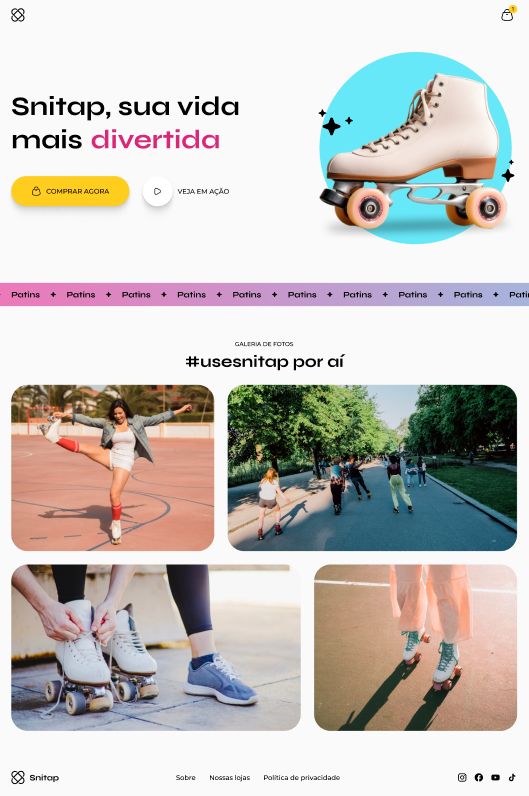

# Snitap-Patins

## 🚀 Tecnologias

Esse projeto foi desenvolvido com as seguintes tecnologias:

- **HTML**
- **CSS**

### 📚 Bibliotecas

- [Google Fonts](https://fonts.google.com/)

## 💻 Projeto

A **Snitap-Patins** é uma projeto pessoal para treinar meus conhecimentos nas tecnologias HTML, CSS.

